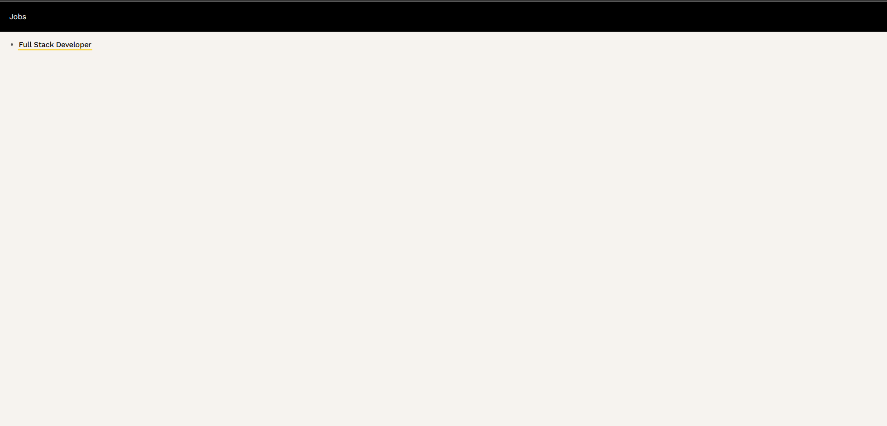
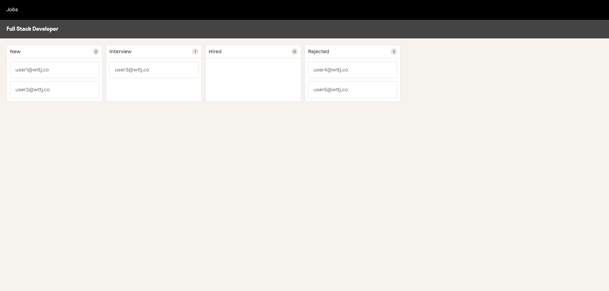

# Wttj Fullstack Developer Test

This README.md is split into two main sections:
- **Technicals informations**: this section is the usual `README.md` of a technical project, with useful information about it (requirements, getting started, tests, etc.).

  **You will find instructions to launch the project in this section, especially following the part explained in the `Launch Demo` part.**
- **Detailed Approach**: details the design choices, development steps, tools, and decisions made during the implementation of this project. It aims to explain the thought process behind each feature, what I managed to do or not, and highlight key technical considerations.

---

# Technical information

## Requirements

For development:

- Elixir 1.17.2-otp-27
- Erlang 27.0.1
- Nodejs 20.11.0
- Yarn
- Docker 27.4.0 (_for lauching demo only_)
- PostgreSQL 17

You can use [`asdf`](https://asdf-vm.com/guide/getting-started.html) to install the required versions of elixir, erlang and nodejs easily.

Simply run:

```bash
asdf install
```

## Launch Demo

There is an available bash script to launch the demo quickly.
The script is available at the root of the project, under the name `start_demo.sh`.

To simplify the launch of the project, this script create a Docker container for the the database and launch all the required commands for the project.
**But you still have to match all the requirements above before launching the demo (except PostgreSQL).**

First make sure the script is exececutable by running:

```bash
chmod +x start_demo.sh
```

Then, you can launch the demo by running:
```bash
./start_demo.sh
```

> Note that the scripts will reset the database at each launch to have a clean database each time.

You can now access the application at `http://localhost:4000/` and you should see the homepage:


You can click on the Job "Full Stack Developer" to see the details of the job and the candidates:



You can now drag and drop candidates to change their status et re-order them as you want (Step 1.).
Also, you can open multiple tab and repeat the previous steps in your browser to visualize the real-time changes (Step 2.).


After your are done with the demo, you can stop it by running `CTRL+C` and run the following commands to remove the database container:

```bash
docker stop wttj-postgres
docker rm wttj-postgres
```

> If any error occurs when launching the demo this way, please try to launch the project by following the `Getting started for development` section below.

## Getting started for development

To start the Phoenix server:

- Run `mix setup` to install and setup dependencies
- Start Phoenix endpoint with `mix phx.server` or inside IEx with `iex -S mix phx.server`
- install assets and start front
    ```bash
    cd assets
    yarn
    yarn dev
    ```

The webapp is accessible at [`localhost:4000`](http://localhost:4000) from a browser.

> Make sure you opened **http://localhost:4000** in your browser and not **http://127.0.0.1:4000**, otherwise you might have CORS errors and not be able to have a working application.

## Launch Unit Tests

- backend: `mix test`
- front: `cd assets & yarn test`

---
 
# Detailed Approach

## 1. Project Setup

**General:**
- **VS Code**: Integrated development environment for writing and debugging code.
- **DBeaver**: For visualising and interacting with Database.
- **Cody AI**: AI assistant in VS Code for development support.
- **ChatGPT**: Used as an assistant for brainstorming, project planning, notes formatting and questions.

**Frontend:**
- **ESLint**: For maintaining consistent code quality and style.
- **React Developer Tools**: For debugging React components efficiently in Chrome.

**Backend:**
- **Elixir Formatter**: Ensures consistent formatting of Elixir code.
- **Elixir LS**: Language server for VS Code to provide IntelliSense and debugging.
- **Credo**: Static code analysis for identifying issues and enforcing best practices.

## 2. Step-by-Step Requirement's Development

### Initial Fixes
Before starting to develop the requirements, I made some initial fixes and adjustments for a clean starting point:

- **Phoenix Dashboard Access**: Resolved route conflict that prevented access to the Phoenix Dashboard.
- **Warnings in Browser Console**: Addressed React warnings related to lists.

### Step 1: Basic Functionality

#### Key Goals
Implement drag-and-drop functionality for candidates accros status columns and ensure the backend supports reordering and updates seamlessly.

#### Backend

I started by the backend API to have a clear understanding of the data structure and the required endpoints.
My goal was to have a simple API that would allow me to update the position and status of candidates as well as fetch the list of candidates.

When going around existing code I noticed few things:
- **Ecto Schema**: Schemas and migrations for candidates and jobs were already provided, saving setup time. As well as seed data for testing.
- **API Endpoints**: Endpoints and Controllers were already in place, especially the Candidate `update` endpoint I needed to update the position and status of candidates.
- **Ordering Logic**: Candidates re-ordering when updating a candidate position would to be the main focus for this development. 

I know at some point, on Step 3., I will have to deals with a lot of candidates. So I decided to directly use the `Ecto.Repo.insert_all/3` function to update the position of candidates to have a efficient insertion of candidates when updating all their positions instead of unitary updates.
I also put the insertion within an `Ecto.Repo.transaction/2` to ensure the integrity of the candidate being updated and all the other being re-ordered thanks to the atomicity property of the transaction.
In case of error or exception, every changes made inside the transaction will be rolled back.

I finally updated the test suite to validate the new logic and ensure non-regression in the futur.


#### Frontend
Then, once the API was developed and tested, I worked on the frontend to display the data and allow the user to drag and drop candidates. 
After some research, I was planning to use `react-beautiful-dnd`, but I quickly switched to its successor, [`pragmatic-drag-and-drop`](https://github.com/atlassian/pragmatic-drag-and-drop), due to deprecation. 

I focus my work on learning React and how to use the drag and drop library, without calling the API directly. Once everything was working as I wanted, I implemented the update Candidate API to have have persistance of the data and a fully working application.
I also iterate on my code to have a clean way to manage the drag and drop logic and created a new Component `CandidateBox` for better readability and reusability.


I used at maximum the same existing logic already developped in the project, like the React Hooks, in order to have a better coherence in the codebase.


#### Challenges
- **Uniqueness Constraints**: Updating multiple candidates within the same or different statuses caused issues with database constraints. The solution involved reordering updates and modifying uniqueness keys to include the candidate ID.
- **React & TypeScript Syntax**: I wasn't familiar with React and TypeScript syntax, which required time to be confortable and understand the different existing part of the existing project. Also, I wanted to follow at maximum the existing code style.

### Step 2: Real-Time Collaboration

#### Key Goals
Enable real-time updates for candidates using WebSockets so multiple users can interact with the board simultaneously.

#### Choice of Technology
To handle real-time updates between backend and frontend, I compared Websockets with Server-Sent Events (SSE), which I didn't know about it before. Since I had the Step 3. in mind I decided to exclude the `polling` solution directly since it can produce produce to much load with a lot of user and data.

#### Comparative Analysis Between WebSockt And SSE
| Feature                | WebSockets                         | Server-Sent Events (SSE)          |
|------------------------|------------------------------------|-----------------------------------|
| Phoenix Integration    | Built-in support via Channels      | Requires custom implementation    |
| Scalability            | High                               | Limited to HTTP connections*      |
| Ease of Testing        | Excellent (native in Elixir tests) | Simple but less integrated        |
| Browser support        | Excellent (all major browsers)     | Limited support in some browsers  |

*_Limited to HTTP connections_: true on HTTP/1 but not on HTTP/2.

I opted for **WebSockets** for the following reasons:
  - Phoenix/Elixir handles WebSockets natively, making it a natural choice without adding extra dependency.
  - Familiarity with WebSocket technology (but with GraphQL subscriptions) allowed faster implementation.
  - Phoenix’s scalability is proven with tools like Phoenix LiveView, which extensively uses WebSockets.


#### Backend

I used Phoenix Websocket for real-time communication between frontend and backend. I followed the official documentation to implement it and expose the `/socket` endpoint through the API as well as creating all the necessary modules.
I created a `CandidateChannel` to handle the WebSocket connection and broadcast updates to all connected clients on `updated_candidate` events. Channels are splitted by job ID in the form of `candidates:job_id` to broadcast only the clients visualising the same job.

Finally, whenever a candidate is updated though the Candidate controller, the `updated_candidate` event is broadcasted to all connected clients.

I updated the test suite to validate this addition.

#### Frontend

I wanted to have a clean way to use the WebSocket in the frontend, so I created a custom hook `useChannel` to handle the connection.
Whenever a candidate is updated, the candidate list is re-fetched for any client consulting the same `JobShow` page (same Job ID) to ensure the columns are up-to-date when interacting with candidates.

### Step 3: Performance optimizations

The main goal of this step was to optimize the application's performance to be able to handle large amount of candidates. In Step 1. and 2. I already implemented some optimizations and described it.
Even if I didn't have a lot of time left to work on this step before reaching the deadline, I wanted to share some optimizations I imagined.

#### Frontend Cache Updates
On the Frontend when there is a change on the candidates list from the API call return or from the WebSocket Channel update, the whole list is re-fetched. It would be better to only update the candidates that have been modified directly in the cache to avoid useless API calls.

It could would a leave to logic changed if implemented along pagination.

#### Data Insertion And Fetching
In the futur, if `Ecto.Repo.insert_all/3` tends to insert to much data at once, we could split the insertion into multiple chunks of fixed size.


We could also use caching strategies like Write-Behind to improve performance when updating candidates positions, but it would require more complex implementation and would be more difficult to maintain.

To reduce the size of the payloads, we could use pagination when fetching candidates from the DB and returning it to the Frontend.


### Step 4: Customization & Extensibility

I didn't have time to implement this step and I prefered to focus on the basic functionalities of the project instead, to have a working base project that I could deliver on time.

## 3. Troubleshoots When Testing The Drag-and-Drop Functionality

### Library and Compatibility

I wanted to follow Atlassian's recommendation when testing drag and drop in the Frontend, therefore I followed [the testing section of Pragmatic Drag and Drop](https://atlassian.design/components/pragmatic-drag-and-drop/core-package/testing/jest-and-jsdom).

As mentioned in it, I used `@atlaskit/pragmatic-drag-and-drop-unit-test` library in order to make Pragmatic drag and drop working with `jsdom` which was already used by the project.

I've encountered several limitations and issues that forced me to skip the component test i've made on the drag and drop:
- JSDOM version must remain at `21.0.0` due to compatibility limitations with the Atlassian library. It seems that release version [21.1.0](https://github.com/jsdom/jsdom/releases/tag/21.1.0) changes on MouseEvent cause `@atlaskit/pragmatic-drag-and-drop-unit-test/drag-event-polyfill` to not work as expected.
    Opening an issue on Atlassian's pragmatic Drag and Drop (since none on this subject actually exists) might be interesting to alert them of the problem or to have recommandations to avoid it.
- `fireEvent.drag*` functions I used to trigger drag and drop event, as recommanded by Atlassian, are not actually updating the DOM, at least they trigger the various drag and drop associated callbacks on the components but nothing more.
- I think it would have been a better idea to test this functionality with Cypress instead, especially to have a visual feedback of what is happening in the browser.


